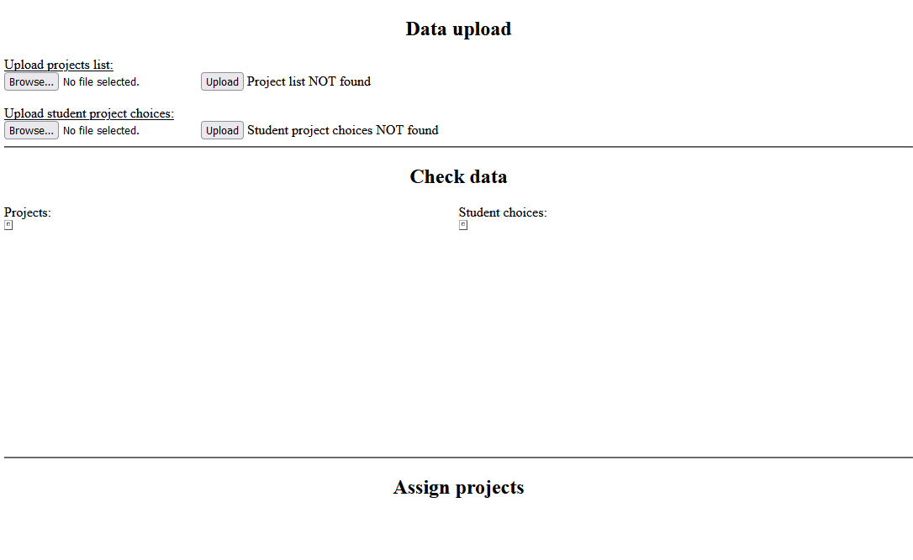
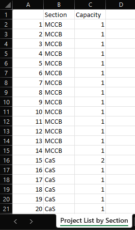
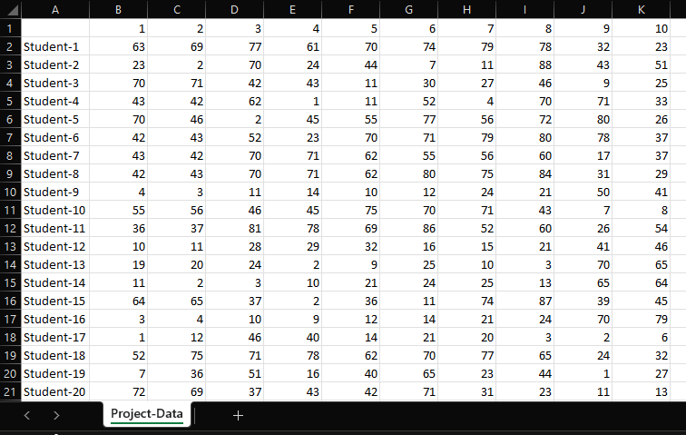
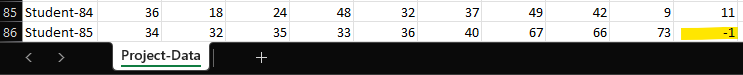
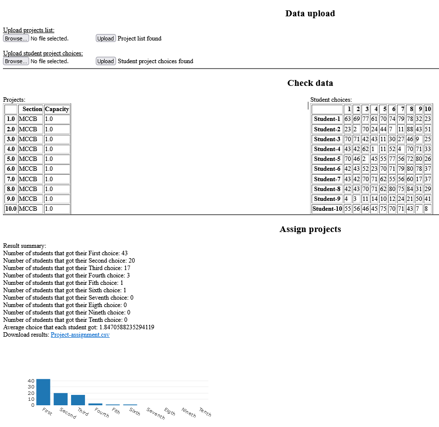

## Student project assignment web application using teh Hungarian algorithm

The initial site will look like this:

First step is to upload 2 CSV files.

The projects list:

And the student choices:

If the student has made 10 choices the blank options should be filled with '-1':

One they have been uploaded the site will preview the csv files and optimise the choices:
